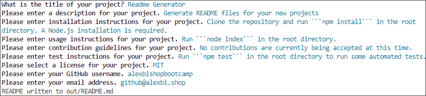

# Readme Generator

[](https://opensource.org/licenses/MIT)

## Description

Generate README files for your new projects

## Table of Contents

* [Installation](#installation)
* [Usage](#usage)
* [License](#license)
* [Contributing](#contributing)
* [Tests](#tests)
* [Questions](#questions)

## Installation

Clone the repository and run ```npm install``` in the root directory. A Node.js installation is required.

## Usage

Run ```node index``` in the root directory and provide answers to the questions as shown below:



This README was generated with these prompts.

A video demoing the use of this app can be found [here](https://drive.google.com/file/d/19j8nTk07nr8D32jvlW_KZr7zqJblKgeX/view?usp=sharing)

## License

This project uses the [MIT](https://opensource.org/licenses/MIT) license.

## Contributing

No contributions are currently being accepted at this time.

## Tests

Run ```npm test``` in the root directory to run some automated tests.

## Questions

If you have any questions, please contact me at [github@alexbi.shop](mailto:github@alexbi.shop).

You can find me on [Github](https://github.com/alexbishopbootcamp).

